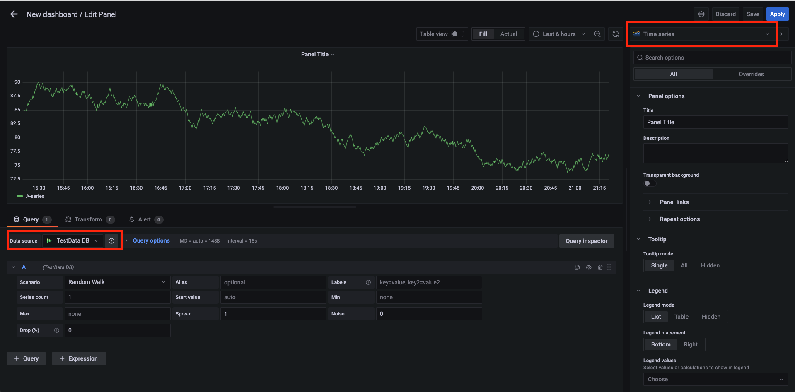

# 101_grafana_first_steps
This repository to learn about grafana dashboarding &amp; alerting

## Table of Contents
* [Grafana in a Docker container](#grafana-in-a-docker-contanier)
* [Grafana - Adding a source](#grafana---adding-a-source)
* [Grafana - Creating step](#grafana---creating-step)
* [Grafana - Dashboards](#grafana---dashboards)
* [Grafana - Explore](#grafana---explore)


## Grafana in a Docker container
First of all we are going to install grafana in a docker container to show how it works

```sh
$ docker volume create grafana-storage
$ docker run -d --name=grafana -p 3000:3000  \
    -v grafana-storage:/var/lib/grafana \
    grafana/grafana
```

Now we have launched the grafana with docker we can go to:
```sh
http://localhost:3000
```

We have to introduce the user 'admin', pass 'admin' and do it again. Now we should reach to this page.


## Grafana - Adding a source

Now we are going to add a source in order to start creating dashboards. We have to click in "Data Sources".


Once we have selected the option "Data Sources", we have to click on "TestData DB"


## Grafana - Creating step

In this section we are going to explain everything about of the creation: Dashboard creation, Folder creation, Import and Alert rule.

### Dashboard creation

If we click on "Dashboard creation" in the plus icon, we will create a new dashboard.


In this point, we are able to:
* add row
* add a new panel
* add panel from library

A **row** is a horizontal element to separate panels in order to show or hide them.

A **panel from library** are panel created and saved in order to reuse them.

Now we are going to create a **new panel**, selecting "add a new panel"



In the creation we can see two boxes that are showing us the data source and the type of the graph that we want to use.

The other three options of creation is to create a folder in order to organize all our dashboards, the import is to reuse dashboards created by other people (it's very useful) and the alert rule that is used to contact with us when some metric is wanted to be reviewed.

## Grafana - Dashboards


In the "Dashboards section" we are able to:
* Go to de Home / Init url. 
* Search in our dashboards with a list or with a searcher.
* Create a playlist to cycle dashboards on TVs without user control.
* Look for an snapshots.
* Search a panel in the library panels.


## Grafana - Explore


In this section we can explore the different data sources to look the info that we want. In our case we have selected the data source "TestData DB" and in the scenario we have selected "Random walk" in order to get a graph and a table with the information.